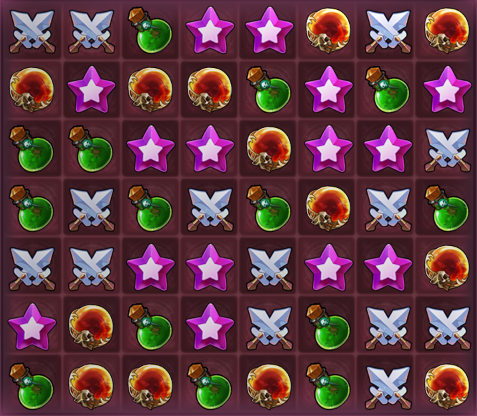
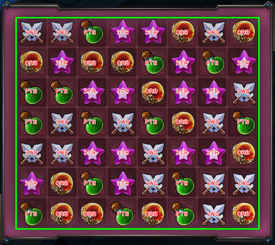
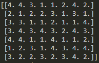

# Reflex-IA

Artificial intelligence to play logic games

## Dependences

* Pillow
* Numpy 
* Win32gui 
    * https://www.lfd.uci.edu/~gohlke/pythonlibs/#pywin32
* OpenCV
* Pyautogui

Currently under development games:

    Mirror
        1280x720

### Board

### Detection

### Output

